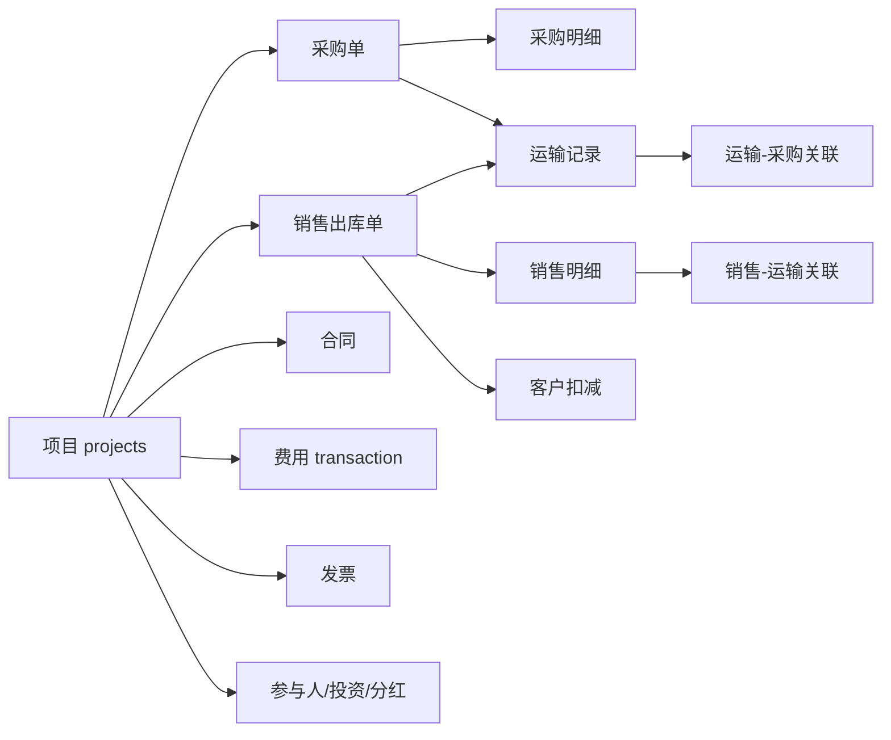

# 工程项目投资采运销分红系统 · 功能介绍

> 版本依据：当前代码库（Flask + SQLite）  
> 系统访问：管理端默认 `http://127.0.0.1:5002`（生产环境端口以实际配置为准）

---

## 一、产品定位与价值

**工程项目投资采运销分红系统**面向**项目型、投资型、贸易型**企业，以**项目**为核算与权限核心，打通：

**工程投资 → 采购 → 运输 → 销售 → 费用 → 合同发票 → 分红 → 报表 → 客户协同**

实现「一处录入、按项目归集、单据可追溯、利润可测算、资金可审计」。

### 1.1 解决的核心问题

| 痛点 | 系统能力 | 业务价值 |
|------|----------|----------|
| 项目盈亏说不清 | 按项目汇总收入、采购、销售、费用、投资、分红 | 项目毛利实时可见 |
| 采运销数据分散 | 采购单、运输、销售出库、对账、采运销汇总报表联动 | 数量金额一条链 |
| 发票合同录入慢 | OCR 识别、Excel 导入、发票与业务单据勾稽 | 录单效率提升 |
| 客户预存款混乱 | 客户协同门户、充值审核、出库扣减同步 | 客户资金透明 |
| 投资人分红难算 | 参与人、出资比例、分红记录与报表 | 投资回报可溯 |
| 责任与数据安全 | 功能权限 + 项目数据权限 + 操作日志 + 自动备份 | 合规可审计 |

### 1.2 技术架构概要

| 层级 | 技术 |
|------|------|
| 后端 | Python 3、Flask 3、Werkzeug |
| 数据库 | SQLite（`project_manager.db`） |
| 前端 | Bootstrap 5、Jinja2、Chart.js |
| 数据处理 | pandas、openpyxl |
| 智能识别 | RapidOCR、OpenCV、Pillow、python-docx |
| 运维 | schedule 定时任务、systemd / 脚本部署 |

---

## 二、功能总览（汇总）

### 2.1 菜单与模块地图

```
经营看板
├── 项目列表 / 项目详情（参与人、投资、分红、费用、合同等）
├── 销售管理：销售合同 | 销售回款 | 销售出库单
├── 采购管理：采购单 | 采购合同 | 对账中心
├── 费用管理：项目费用（收支记录）
├── 合同发票：合同列表 | 发票管理 | 销售发票 | 采购发票
├── 报表分析：报表中心（多专题报表）
├── 基础资料：参与人/投资人 | 供应商 | 客户 | 费用分类 | 付款类型
├── 客户协同：协同总览 | 充值审核 | 协同报表 | 同步扣减 | 账号与专员
└── 系统管理（管理员）：账号管理 | 备份管理 | 操作日志
```

### 2.2 角色与权限体系

| 角色 | 典型能力 |
|------|----------|
| **管理员 (admin)** | 全部功能、账号与备份、全项目数据 |
| **财务 (finance)** | 全项目数据；无账号/备份管理；可导出报表 |
| **项目经理 (manager)** | 授权项目内业务编辑；报表查看导出 |
| **普通用户 (user)** | 以查看为主，部分录入 |
| **客户协同专员 (client_collab)** | 仅客户协同菜单；按负责客户隔离 |
| **客户协同管理员 (client_collab_admin)** | 协同 + 部分报表 |

**两类权限控制：**

1. **功能权限**：如 `purchase.view`、`sales.edit`、`invoice.view`、`report.export` 等，在「账号管理 → 权限配置」中按用户勾选。  
2. **项目数据权限**：非 admin/finance 用户仅能见/操作「已授权项目」的单据与报表；管理员、财务可见全部项目。

### 2.3 核心单据与状态

| 单据 | 主要状态 | 说明 |
|------|----------|------|
| 采购单 | 草稿 → 已提交 → 运输中/已到货/已完成 | 提交后可录运输；支持批量提交/反提交 |
| 销售出库单 | 待审核 → 已提交 → 运输中/已送达/已完成 | 提交后可录运输；支持批量提交/反提交 |
| 合同 | 草稿 → 审批中 → 执行中/已完成/已终止 | 支持批量提交/反提交（审批中→草稿） |
| 对账单 | 待对账/对账一致等 | 关联采购单，确认后限制采购反提交 |

---

## 三、按模块功能详解

### 3.1 经营看板

- 展示项目总数、合同金额、费用与毛利等核心指标。  
- 项目状态分布、最近操作动态。  
- 快捷进入报表中心重点报表（经营驾驶舱、预警等）。

### 3.2 项目管理

- **项目档案**：名称、状态、描述、预算等。  
- **项目详情多页签**：  
  - 项目参与人（角色、投资比例、分红比例）  
  - 项目启用费用分类（白名单）  
  - 费用收支记录  
  - 投资记录、分红记录  
  - 合同、付款、往来款等汇总视图  
- **项目盈亏**：收入 − 支出 − 费用 − 分红等，在项目详情与报表中体现。  
- **项目名称变更**：各业务单据通过 `project_id` 关联，列表展示实时项目名称（非冗余存储旧名）。

### 3.3 投资管理与分红

- **参与人/投资人档案**（基础资料 → 参与人管理）。  
- **项目投资**：按项目登记出资，系统自动重算各参与人**投资比例**。  
- **分红记录**：按项目登记分红金额、日期；支持编辑、删除。  
- **分红规则/批次**（模板与扩展路由）：支持批次分红场景（以项目详情及扩展页为准）。  
- **报表**：「出资与分红」专题分析参与人出资与分红回报。

### 3.4 销售管理

#### 3.4.1 销售合同

- 销售类合同列表、录入、编辑。  
- 与项目、客户业务关联。

#### 3.4.2 销售回款

- 回款登记、列表筛选。  
- 支撑「销售回款分析」报表（应收、已回款、回款率）。

#### 3.4.3 销售出库单（核心）

- 出库单头：项目、合同、客户、日期、状态等。  
- **出库明细**：品名、规格、数量、单价、金额。  
- **提交 / 反提交**：待审核 ↔ 已提交；列表支持**批量勾选提交、批量反提交**。  
- **运输记录**：提交后可录入运输车次、数量、运费；支持 Excel 导入、运输截图 OCR。  
- **销售对账视图**：出库明细与运输数量对照。  
- **删除**：仅**待审核**可删；级联清理明细、运输、客户扣减等关联数据。  
- **权限**：按项目数据范围过滤；需 `sales.view` / `sales.edit`。

### 3.5 采购管理

#### 3.5.1 采购单

- 采购单头：项目、供应商、类型、金额、日期。  
- **采购明细**、**运输关联**（`transport_purchase_items`）。  
- **提交 / 反提交**：草稿 ↔ 已提交；**批量提交 / 批量反提交**。  
- **删除**：仅**草稿**可删；级联运输、对账等。  
- 列表汇总：金额、数量、运费、运输车次（可选「汇总含未提交」）。

#### 3.5.2 采购合同

- 导航入口：采购管理 → 采购合同（支出合同类型筛选）。

#### 3.5.3 对账中心

- 按采购单生成对账：采购数量 vs 运输数量、损耗率等。  
- 对账确认后，对应采购单**不可反提交**。  
- 「对账差异汇总」报表。

#### 3.5.4 运输导入

- 运费明细 Excel 批量导入（`transport_import`）。

### 3.6 费用管理

- **项目费用**：按项目录入收支（关联费用分类）。  
- 分类须在**项目详情 → 费用分类**中启用后方可使用。  
- 支持 **OCR 上传**识别票据、**Excel 导入**批量迁移。  
- 报表：费用盈亏分析、费用分类结构。

### 3.7 合同与发票

#### 3.7.1 合同列表

- 收入合同 / 支出合同。  
- 状态：草稿、审批中、执行中、已完成、已终止等。  
- **批量提交审批 / 批量反提交**（审批中→草稿）。

#### 3.7.2 发票管理（发票中心）

- **发票总览 Hub**：进销项导航。  
- **销售发票 / 采购发票**：按业务方向管理。  
- 功能要点：  
  - 按项目、日期、对方单位筛选  
  - 与采购/销售业务**汇总勾稽**（`invoice_summary_allocations`）  
  - 单张录入、批量开票、Excel 导入、OCR 识别  
  - 「含未提交单据」选项影响汇总范围  
- 权限：`invoice.view`、`invoice.edit`。

### 3.8 报表分析中心

报表按 **8 大模块** 分组展示：

| 模块 | 代表报表 |
|------|----------|
| 综合经营 | 经营驾驶舱、项目盈利对比、资金收支趋势、经营预警、**采运销汇总明细表** |
| 项目费用 | 费用盈亏分析、费用分类结构 |
| 销售 | 销售出库分析、销售出库明细表、销售回款分析 |
| 采购 | 采购支出分析、运费成本分析 |
| 合同发票 | 合同执行漏斗、进销项发票汇总 |
| 投资管理 | 出资与分红 |
| 对账 | 对账差异汇总 |
| 客户协同 | 客户资金全景（协同角色可见） |

共性能力：日期范围、项目筛选、部分报表支持导出（`report.export`）、按角色隐藏敏感报表。

### 3.9 基础资料

| 资料 | 用途 |
|------|------|
| 参与人/投资人 | 项目出资与分红对象 |
| 供应商 | 采购单、运费、发票 |
| 客户 | 销售出库、回款、协同账户 |
| 费用分类 | 全局科目树；项目级启用子集 |
| 付款类型 | 付款、往来款分类 |

### 3.10 客户协同

- **协同总览**：负责客户的账户、余额、动态。  
- **充值审核**：客户门户提交的充值申请，批量通过/拒绝/反审核。  
- **同步扣减**：将销售出库等同步为客户账户扣减记录。  
- **协同报表**：客户资金类分析。  
- **客户门户**（`/portal/login`）：客户自助查余额、申请充值。  
- **数据隔离**：协同专员仅见授权客户；与 `customer_id` 绑定。

### 3.11 系统管理

- **账号管理**：用户、角色、功能权限、授权项目。  
- **备份管理**：手动/定时数据库备份（`backups/`）；支持本机 `.db` 上传预览、保存至服务器；备份数据预览（汇总与明细）。
- **新建项目引入**：可从服务器备份或本机上传的备份中，将某一历史项目的业务数据复制到新项目。  
- **操作日志**：关键业务操作审计。  
- **自动部署钩子**（开发环境）：Cursor `stop` 钩子可触发 `tools/deploy_to_server.ps1`（可选）。

---

## 四、数据关联关系（业务底座）



**设计原则：**

- 业务单据保存 **project_id**，项目名称变更后列表通过关联查询展示最新名称。  
- 删除单据时按依赖顺序级联（扣减 → 运输 → 明细 → 主单），避免外键错误。

---

## 五、典型使用场景

1. **贸易项目全程**：立项 → 采购入库与运费 → 销售出库 → 采运销报表对毛利 → 开票 → 回款。  
2. **合资投资项目**：维护参与人与出资 → 项目盈利 → 按分红比例登记分红 → 出资与分红报表。  
3. **客户预存款模式**：客户门户充值 → 财务审核 → 出库自动/同步扣减 → 客户资金报表。  
4. **财务月度关账**：费用盈亏 + 发票汇总 + 对账差异 + 经营驾驶舱导出分析。

---

## 六、相关文档

- 操作步骤详见：[02-软件操作手册.md](./02-软件操作手册.md)  
- 安装部署详见：[03-部署运维手册.md](./03-部署运维手册.md)  
- 简要宣传版：[../业务功能介绍.md](../业务功能介绍.md)
