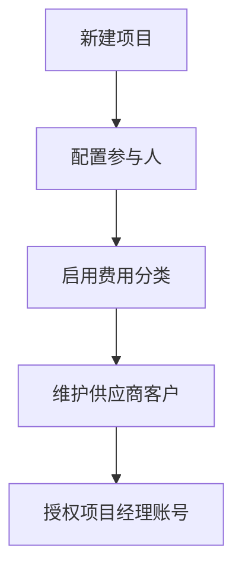
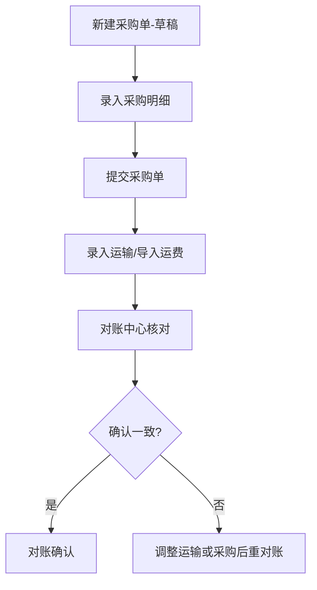
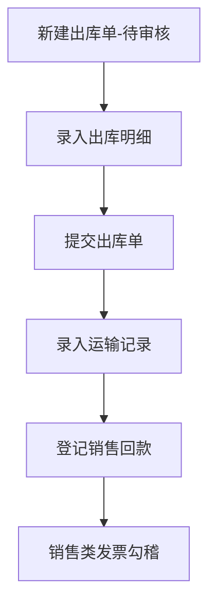

# 工程项目投资采运销分红系统 · 软件操作手册

> 适用对象：业务人员、财务、项目经理、系统管理员  
> 默认管理端地址：`http://127.0.0.1:5002`（生产环境以实际为准）

---

## 目录

**Part A — 通用操作**  
1. [登录与界面](#1-登录与界面)  
2. [权限与项目范围](#2-权限与项目范围)  

**Part B — 按模块操作**  
3. [经营看板](#3-经营看板)  
4. [项目管理](#4-项目管理)  
5. [销售管理](#5-销售管理)  
6. [采购管理](#6-采购管理)  
7. [费用管理](#7-费用管理)  
8. [合同与发票](#8-合同与发票)  
9. [报表中心](#9-报表中心)  
10. [基础资料](#10-基础资料)  
11. [客户协同](#11-客户协同)  
12. [系统管理](#12-系统管理)  

**Part C — 按业务流程操作**  
13. [流程一：新项目立项与基础配置](#13-流程一新项目立项与基础配置)  
14. [流程二：采购入库与对账](#14-流程二采购入库与对账)  
15. [流程三：销售出库与回款](#15-流程三销售出库与回款)  
16. [流程四：费用录入与 OCR](#16-流程四费用录入与-ocr)  
17. [流程五：合同审批与发票勾稽](#17-流程五合同审批与发票勾稽)  
18. [流程六：投资出资与分红](#18-流程六投资出资与分红)  
19. [流程七：客户充值与出库扣减](#19-流程七客户充值与出库扣减)  
20. [流程八：月度经营分析](#20-流程八月度经营分析)  

---

# Part A — 通用操作

## 1. 登录与界面

| 步骤 | 操作 |
|------|------|
| 1 | 浏览器打开系统地址，进入登录页 |
| 2 | 输入用户名、密码，点击登录 |
| 3 | 默认管理员：`admin` / `admin123`（**首次登录后请修改密码**） |
| 4 | 登录后顶部为主导航；左侧/顶部菜单进入各模块 |
| 5 | 右上角显示当前用户与角色；点击「退出」安全登出 |

**说明：**

- **客户协同专员**使用同一登录页，登录后仅显示「客户协同」相关菜单。  
- **客户门户**使用独立地址：`/portal/login`（与客户账户绑定）。

---

## 2. 权限与项目范围

### 2.1 看不到某项目或单据？

1. 确认账号是否勾选对应**功能权限**（如「查看销售」「编辑采购」）。  
2. 非管理员/财务用户，需在「账号管理」中为其**授权项目**。  
3. 列表页用「项目」筛选器确认是否在授权范围内。

### 2.2 提示「无权访问该项目」

- 该单据所属 `project_id` 不在当前用户授权列表中。  
- 联系管理员在「账号管理 → 授权项目」中增加项目，或使用 admin/finance 账号处理。

### 2.3 批量操作权限

- 采购/销售批量提交、反提交：需 `purchase.edit` / `sales.edit`。  
- 发票编辑：需 `invoice.edit`。  
- 报表导出：需 `report.export`。

---

# Part B — 按模块操作

## 3. 经营看板

**路径：** 看板  

| 操作 | 说明 |
|------|------|
| 查看指标 | 项目数、合同金额、费用与毛利等卡片 |
| 进入报表 | 点击卡片或链接跳转报表中心对应专题 |
| 查看动态 | 最近操作日志摘要（如有展示） |

---

## 4. 项目管理

### 4.1 项目列表

**路径：** 项目列表  

| 操作 | 步骤 |
|------|------|
| 新建项目 | 点击「新增项目」→ 填写名称、状态、预算等 → 保存 |
| 筛选 | 按状态、关键词筛选 |
| 进入详情 | 点击项目名称 |

### 4.2 项目详情（核心工作台）

**路径：** 项目列表 → 某项目  

| 页签 | 主要操作 |
|------|----------|
| 项目参与人 | 添加/移除参与人；设置项目角色、**分红比例**（投资比例由出资自动计算） |
| 费用分类 | 勾选本项目启用的费用科目（未启用科目无法在该项目录费用） |
| 费用记录 | 查看本项目收支；可跳转费用录入 |
| 投资记录 | 新增/编辑/删除出资记录 |
| 分红记录 | 新增/编辑/删除分红 |
| 其他 | 合同、付款、往来款等汇总（视页签配置） |

### 4.3 编辑项目基本信息

- 管理员可在项目编辑页修改**项目名称**等。  
- 修改后，采购/销售/合同等列表中的项目名称会**自动显示新名称**（通过项目编号关联）。

---

## 5. 销售管理

### 5.1 销售出库单列表

**路径：** 销售管理 → 销售出库单  

| 功能 | 操作说明 |
|------|----------|
| 筛选 | 项目、状态、客户、「汇总含未提交」 |
| 汇总卡片 | 销售金额、数量、运费、笔数 |
| 批量提交 | 勾选「待审核」行 →「全选可提交」→「批量提交」 |
| 批量反提交 | 勾选可反提交行 →「批量反提交」（不含已完成） |
| 单笔操作 | 查看 / 编辑 / 删除（仅待审核可删）/ 反提交 |

### 5.2 新建销售出库单

| 步骤 | 操作 |
|------|------|
| 1 | 销售出库单列表 →「新增出库单」 |
| 2 | 选择**项目**（须在授权范围内）、合同、客户、日期等 |
| 3 | 保存后进入**详情页** |
| 4 | 添加**出库明细**（品名、规格、数量、单价） |
| 5 | 确认无误后点击「**提交**」（或列表批量提交） |
| 6 | 提交后可添加**运输记录**（手工或 Excel/OCR 导入） |

### 5.3 销售出库单详情

| 操作 | 条件 |
|------|------|
| 编辑头信息 | 非「已完成/已取消」状态 |
| 提交 | 状态为「待审核」且有明细 |
| 反提交 | 非待审核、非已完成 → 变回待审核 |
| 删除 | **仅待审核**；会清理明细、运输、客户扣减关联 |
| 销售对账 | 查看明细与运输数量对照 |
| OCR 运输 | 上传运输单图片识别后确认写入 |

### 5.4 销售合同 / 销售回款

- **销售合同**：列表维护合同金额与进度。  
- **销售回款**：登记回款记录，供「销售回款分析」报表使用。

---

## 6. 采购管理

### 6.1 采购单列表

**路径：** 采购管理 → 采购单列表  

操作逻辑与销售出库单类似：

| 状态 | 可执行操作 |
|------|------------|
| 草稿 | 编辑、删除、**提交**（含批量） |
| 已提交 | 反提交（对账已确认则不可反提交）、录运输 |
| 运输中/已到货/已完成 | 查看为主 |

**批量操作：** 列表顶部「批量提交」「批量反提交」+ 行首复选框。

### 6.2 新建采购单

| 步骤 | 操作 |
|------|------|
| 1 | 新增采购单 → 选项目、供应商、类型 |
| 2 | 填写采购明细 |
| 3 | 保存 → 详情页 **提交** |
| 4 | 提交后录入运输记录或 Excel 导入运费 |

### 6.3 对账中心

**路径：** 采购管理 → 对账中心  

| 步骤 | 操作 |
|------|------|
| 1 | 从列表进入待对账采购单，或采购详情发起对账 |
| 2 | 核对采购数量与运输数量、损耗率 |
| 3 | 确认对账结果 |
| 4 | 对账确认后，该采购单不可再反提交 |

---

## 7. 费用管理

**路径：** 费用管理 → 项目费用  

| 操作 | 步骤 |
|------|------|
| 录入费用 | 选择项目 → 选择**已启用**的费用分类 → 填金额、日期、说明 → 保存 |
| OCR 录入 | 使用 OCR 上传页（如有入口）上传票据 → 核对识别结果 → 确认保存 |
| Excel 导入 | 费用管理相关导入页按模板批量导入 |
| 查看/删除 | 费用列表中维护（需对应编辑权限） |

---

## 8. 合同与发票

### 8.1 合同

**路径：** 合同发票 → 合同列表  

| 操作 | 说明 |
|------|------|
| 新增/编辑 | 填写合同编号、类型（收入/支出）、项目、金额 |
| 提交审批 | 草稿 → 审批中（可批量） |
| 反提交 | 审批中 → 草稿（可批量） |
| 完成/终止 | 执行中合同可标记完成或终止 |

### 8.2 发票

**路径：** 合同发票 → 发票管理 / 销售发票 / 采购发票  

| 操作 | 说明 |
|------|------|
| 筛选 | 项目、日期、方向、是否含未提交单据 |
| 新增发票 | 手工录入或使用 OCR/Excel |
| 业务勾稽 | 在发票方向 Hub 中按采购/销售汇总勾选开票 |
| 批量开票 | 按汇总选择多条业务行批量生成发票分配 |
| 编辑/删除 | 需 `invoice.edit` |

---

## 9. 报表中心

**路径：** 报表  

| 操作 | 说明 |
|------|------|
| 浏览 | 按模块卡片进入各专题报表 |
| 筛选 | 常见：开始/结束日期、项目、客户、供应商、品名等 |
| 采运销汇总 | 综合模块 →「采运销汇总明细表」；可勾选「含未提交/草稿」 |
| 导出 | 部分报表支持导出（需 `report.export`） |

---

## 10. 基础资料

**路径：** 基础资料  

维护顺序建议：**费用分类 → 供应商/客户/参与人 → 付款类型**，再开展业务录单。

| 资料 | 要点 |
|------|------|
| 参与人 | 可关联系统用户；用于项目投资与分红 |
| 供应商 | 采购单、运费 |
| 客户 | 销售出库、回款、协同账户绑定 |
| 费用分类 | 树形科目；项目详情中启用子集 |
| 付款类型 | 付款与往来款分类 |

---

## 11. 客户协同

**路径：** 客户协同（admin / 协同角色可见）  

| 功能 | 操作 |
|------|------|
| 协同总览 | 查看负责客户的账户与余额 |
| 充值审核 | 勾选记录 → 批量通过/拒绝/反审核 |
| 同步扣减 | 按规则将出库数据同步为扣减记录 |
| 账号与专员 | 维护协同专员与负责客户关系（管理员） |

**客户门户：** 客户登录 → 查看余额 → 提交充值申请 → 等待管理员审核。

---

## 12. 系统管理

**路径：** 管理（仅管理员）  

### 12.1 账号管理

| 操作 | 说明 |
|------|------|
| 新增用户 | 设置用户名、密码、角色 |
| 功能权限 | 勾选模块权限码 |
| 授权项目 | 为非财务/管理员用户指定可见项目 |
| 客户协同 | 绑定负责客户范围 |

### 12.2 备份管理

- 手动备份数据库。  
- 系统可定时备份至 `backups/`（依赖 schedule 任务运行）。  
- **预览**：在备份列表点击「预览」，可查看各项目金额汇总与业务明细（合同、采购、销售、费用等）。  
- **本机备份**：在「本机备份文件」区域从电脑文件夹选择 `*.db` 上传，可预览；点击「保存到服务器备份」后纳入备份列表，可下载或用于后续恢复。  
- 按时间段批量删除历史备份（不可恢复，请谨慎操作）。

### 12.2.1 新建项目时从备份引入业务数据（管理员）

适用于用历史备份中的**某一个项目**数据初始化新项目（复制采购、销售、合同、费用等，不覆盖整库）：

1. **项目列表 → 新增项目**。  
2. 在「从备份引入业务数据」中选择来源：  
   - **服务器备份**：从 `backups/` 列表选择；  
   - **本地上传 .db**：从本机任意路径选择 SQLite 备份文件（上传后选源项目）。  
3. 点击 **预览将引入的数据**，核对汇总与明细。  
4. 勾选 **我已预览并确认**，保存项目后即完成引入。

> 整库覆盖恢复需在服务器运维侧替换 `project_manager.db` 并重启服务，参见《部署运维手册》备份与回滚章节。

### 12.3 操作日志（管理员）

- **明细列表**：按日期范围、指定某一天、用户名、操作关键词筛选；显示功能模块与影响条数。  
- **按天查看**：按日期汇总每日操作次数、活跃用户、记录条数；可点击进入当天明细。  
- **按时间段删除**：批量删除指定日期范围内的操作日志（可选同时删除功能访问统计），不可恢复。  
- **用户操作分析**（`/logs/analytics`）：统计各用户的操作次数、功能种类、菜单点击次数、单据操作次数、记录条数、主要操作时段及常用功能。

---

# Part C — 按业务流程操作

## 13. 流程一：新项目立项与基础配置

| 序号 | 角色 | 操作 |
|------|------|------|
| 1 | 管理员 | 项目列表 → 新增项目 |
| 2 | 管理员/财务 | 项目详情 → 添加参与人、设置分红比例 |
| 3 | 管理员/财务 | 项目详情 → 费用分类页签 → 勾选启用科目 |
| 4 | 业务 | 基础资料 → 维护本项目供应商、客户 |
| 5 | 管理员 | 账号管理 → 创建用户 → 勾选权限 + 授权本项目 |

---

## 14. 流程二：采购入库与对账

| 序号 | 操作要点 |
|------|----------|
| 1 | 草稿状态可编辑、可删除；支持列表**批量提交** |
| 2 | 提交后状态为「已提交」，可录运输 |
| 3 | 运输数量、运费写入 `transport_records` |
| 4 | 对账确认后勿随意反提交；需改单须先处理对账状态 |
| 5 | 「采购支出分析」「运费成本分析」报表复核 |

**常见提示：**

- 「仅草稿可删除」→ 先反提交再删。  
- 「对账已确认无法反提交」→ 联系财务处理对账记录。

---

## 15. 流程三：销售出库与回款

| 序号 | 操作要点 |
|------|----------|
| 1 | 列表可**批量提交**多条待审核出库单 |
| 2 | 已送达等状态仍可编辑头信息（已完成除外） |
| 3 | 需改已提交单：先**反提交**（含批量）→ 编辑 → 再提交 |
| 4 | 删除仅**待审核**；有客户扣减时会一并清理 |
| 5 | 回款在销售回款模块登记；报表看回款率 |

---

## 16. 流程四：费用录入与 OCR

| 序号 | 操作 |
|------|------|
| 1 | 确认项目已启用对应费用分类 |
| 2 | 费用管理 → 新增记录 或 OCR 页上传图片 |
| 3 | 核对 OCR 识别的金额、日期、对方单位 |
| 4 | 保存后在项目详情、费用盈亏报表中查看 |

---

## 17. 流程五：合同审批与发票勾稽

| 序号 | 操作 |
|------|------|
| 1 | 合同列表录入草稿合同 |
| 2 | 批量或单笔「提交审批」→ 审批中 |
| 3 | 审批通过后进入执行（按实际业务约定） |
| 4 | 发票管理 → 选择销售/采购方向 |
| 5 | 按业务汇总勾选未开票金额 → 登记发票 |
| 6 | 「进销项发票汇总」「合同执行漏斗」报表复核 |

---

## 18. 流程六：投资出资与分红

| 序号 | 操作 |
|------|------|
| 1 | 基础资料维护参与人 |
| 2 | 项目详情 → 投资记录 → 登记各参与人出资金额 |
| 3 | 系统自动计算投资占比 |
| 4 | 项目盈利后 → 分红记录 → 登记分红 |
| 5 | 报表 → 投资管理 →「出资与分红」 |

---

## 19. 流程七：客户充值与出库扣减

| 序号 | 操作 | 角色 |
|------|------|------|
| 1 | 客户门户提交充值申请 | 客户 |
| 2 | 客户协同 → 充值审核 → 通过 | 财务/协同 |
| 3 | 业务录入销售出库并提交 | 业务 |
| 4 | 协同 → 同步扣减（如启用） | 协同专员 |
| 5 | 协同报表查看余额与扣减 | 财务 |

---

## 20. 流程八月度经营分析

| 序号 | 报表/操作 |
|------|-----------|
| 1 | 经营驾驶舱 — 全局指标 |
| 2 | 经营预警 — 超支、未回款、待对账 |
| 3 | 采运销汇总明细表 — 采购+运费+销售一览 |
| 4 | 费用盈亏 + 发票汇总 |
| 5 | 对账差异汇总 |
| 6 | 备份管理 — 月末手动备份（管理员） |

---

## 附录：常见问题

| 现象 | 处理 |
|------|------|
| 删除失败 | 销售仅待审核可删；采购仅草稿可删；看具体提示 |
| 无法提交 | 检查是否有明细行 |
| 批量操作无反应 | 须先勾选复选框；刷新页面重试 |
| 报表无数据 | 检查日期范围、项目筛选、「含未提交」选项 |
| OCR 识别不准 | 手工修正后保存；尽量清晰拍摄 |

---

**相关文档：** [01-系统功能介绍.md](./01-系统功能介绍.md) · [03-部署运维手册.md](./03-部署运维手册.md)
