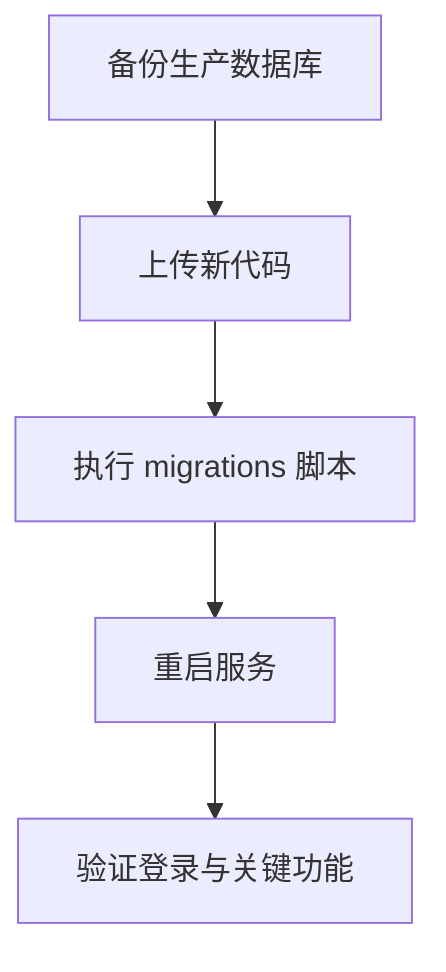

# 工程项目投资采运销分红系统 · 部署运维手册

> 说明如何从**源代码**完成本地开发、测试、生产部署、升级与日常运维。  
> 示例生产环境：`36.212.73.151:888`，目录 `/opt/project_manager/project_manager/`（以实际为准）。

---

## 目录

1. [环境要求](#1-环境要求)  
2. [获取源代码](#2-获取源代码)  
3. [本地开发部署](#3-本地开发部署)  
4. [生产服务器目录规划](#4-生产服务器目录规划)  
5. [生产部署方式](#5-生产部署方式)  
6. [升级与数据库迁移](#6-升级与数据库迁移)  
7. [服务进程与反向代理](#7-服务进程与反向代理)  
8. [备份与回滚](#8-备份与回滚)  
9. [自动部署与 Git 同步](#9-自动部署与-git-同步)  
10. [安全与密钥](#10-安全与密钥)  
11. [故障排查](#11-故障排查)  

---

## 1. 环境要求

### 1.1 服务器 / 开发机

| 项目 | 要求 |
|------|------|
| 操作系统 | Windows 10+（开发）/ Linux（生产推荐） |
| Python | **3.10+**（与 `requirements.txt` 兼容） |
| 磁盘 | 建议 ≥ 2GB（含数据库、上传、备份） |
| 内存 | 建议 ≥ 2GB（OCR 识别时占用更高） |
| 网络 | 生产需开放 Web 端口（如 888、5002） |

### 1.2 Python 依赖

项目根目录 `requirements.txt` 主要包含：

```
Flask==3.0.0
Werkzeug==3.0.1
pandas, openpyxl, Pillow, python-docx, requests, schedule
rapidocr-onnxruntime, opencv-python-headless, numpy
```

安装命令：

```bash
cd /path/to/项目目录
pip install -r requirements.txt
```

> Linux 生产环境建议使用 `pip3`；必要时使用虚拟环境 `python3 -m venv venv && source venv/bin/activate`。

### 1.3 运行时自动创建的目录

| 目录 | 用途 |
|------|------|
| `project_manager.db` | SQLite 主库（首次启动 `init_db` 创建） |
| `backups/` | 数据库备份 |
| `uploads/` | 上传附件、OCR 图片 |
| `static/` | 静态资源 |

---

## 2. 获取源代码

### 2.1 从 GitHub 克隆

```bash
git clone https://github.com/czmtxz/project-manager-system.git
cd project-manager-system
```

（仓库名以 GitHub 实际为准；本地文件夹名可为「项目管理系统」等。）

### 2.2 从压缩包

1. 下载发布包或 `tools/make_deploy_bundle.ps1` 生成的 `deploy_bundle.zip`。  
2. 解压到目标目录，保留完整目录结构（`app.py`、`templates/`、`migrations/` 等）。

### 2.3 核心文件清单（部署必含）

| 类型 | 路径 |
|------|------|
| 入口 | `app.py` |
| 扩展路由 | `route_extensions.py` |
| 报表 | `reports_routes.py`, `report_service.py`, `report_registry.py`, `report_export.py` 等 |
| 权限 | `user_access.py`, `auth_utils.py` |
| 业务 | `invoice_mgmt.py`, `project_display.py`, `client_collab_ops.py`, `client_portal_utils.py`, `ocr_utils.py` |
| 前端 | `templates/`, `static/` |
| 迁移 | `migrations/` |
| 工具 | `tools/server_post_deploy.sh`, `tools/deploy_to_server.ps1` |
| 依赖 | `requirements.txt` |

---

## 3. 本地开发部署

### 3.1 Windows 快速启动

```bash
pip install -r requirements.txt
python app.py
```

或双击：`一键启动工程项目投资采运销分红系统.bat`

### 3.2 访问与默认账号

- 地址：`http://127.0.0.1:5002`  
- 管理端默认：`admin` / `admin123`  
- **首次登录后请修改密码**

### 3.3 开发模式说明

`app.py` 末尾 `app.run(host='0.0.0.0', port=5002, debug=True)` 适用于开发；**生产勿长期开启 debug**。

### 3.4 环境变量（可选）

| 变量 | 说明 |
|------|------|
| `PUBLIC_BASE_URL` | 客户门户对外链接基址，如 `http://IP:888/` |
| `DEPLOY_SSH_KEY` | Windows 自动部署脚本使用的 SSH 私钥路径 |
| `DATABASE` | 若扩展支持，可指定库路径（默认 `project_manager.db`） |

---

## 4. 生产服务器目录规划

推荐目录结构（与当前生产一致）：

```
/opt/project_manager/project_manager/
├── app.py
├── *.py                 # 业务模块
├── requirements.txt
├── project_manager.db   # 生产数据库（勿覆盖丢失）
├── templates/
├── static/
├── migrations/
├── tools/
│   ├── server_post_deploy.sh
│   ├── deploy_to_server.ps1   # 在开发机执行
│   └── migrate_*.py
├── backups/
├── uploads/
└── .ssh_deploy_key        # 勿提交 Git；仅运维持有
```

---

## 5. 生产部署方式

### 5.1 方式 A：自动脚本部署（推荐，从开发机 Windows）

**前提：**

1. 开发机可 SSH 到服务器。  
2. 私钥放在项目根目录 `.ssh_deploy_key`，或设置：

```powershell
$env:DEPLOY_SSH_KEY = "C:\path\to\private_key"
```

**执行：**

```powershell
cd "C:\Users\User\Desktop\项目管理系统"
powershell -ExecutionPolicy Bypass -File .\tools\deploy_to_server.ps1
```

静默模式（供 Cursor 钩子）：加 `-Quiet`。

**脚本行为概要：**

1. SSH 连通性检查  
2. 上传根目录 `*.py`（排除 test/check 类）、`templates/`、部分 `static/`、`migrations/`、`tools/` 脚本  
3. 远程执行迁移：`client_collab_isolation.py`、`migrate_client_customer_binding.py`、`fix_user_roles_on_server.py`  
4. 重启 `project_manager` 或 `gunicorn` 或后台 `app.py`  
5. HTTP 健康检查 `http://36.212.73.151:888/login`

详细说明见：`tools/DEPLOY_SERVER.md`

### 5.2 方式 B：手动 SCP（Linux/macOS/Windows OpenSSH）

```powershell
$KEY = "C:\path\to\private_key"
$SRV = "root@36.212.73.151"
$R = "/opt/project_manager/project_manager"

# 核心 Python
scp -i $KEY app.py user_access.py project_display.py invoice_mgmt.py `
  route_extensions.py report_*.py reports_routes.py auth_utils.py `
  client_*.py ocr_utils.py requirements.txt "${SRV}:${R}/"

# 模板与迁移
scp -i $KEY -r templates migrations "${SRV}:${R}/"

# 部署后脚本
scp -i $KEY tools/server_post_deploy.sh "${SRV}:${R}/tools/"
ssh -i $KEY $SRV "chmod +x ${R}/tools/server_post_deploy.sh && bash ${R}/tools/server_post_deploy.sh"
```

### 5.3 方式 C：部署包 zip（宝塔 / 面板）

```powershell
powershell -ExecutionPolicy Bypass -File .\tools\make_deploy_bundle.ps1
```

1. 将生成的 `deploy_bundle.zip` 上传到服务器。  
2. 解压到 `/opt/project_manager/project_manager/`（**不要覆盖**已有 `project_manager.db`，除非明确要替换）。  
3. SSH 执行：

```bash
cd /opt/project_manager/project_manager
bash tools/server_post_deploy.sh
```

### 5.4 方式 D：服务器首次全新安装（无数据）

```bash
# 1. 安装 Python3 与 pip
apt update && apt install -y python3 python3-pip

# 2. 上传/克隆代码到目标目录
cd /opt/project_manager/project_manager

# 3. 安装依赖
pip3 install -r requirements.txt

# 4. 首次启动（自动 init_db）
python3 app.py
# Ctrl+C 停止后改用 systemd 或 nohup 常驻

# 5. 配置 systemd（示例见第 7 节）
```

---

## 6. 升级与数据库迁移

### 6.1 标准升级流程



| 步骤 | 命令/操作 |
|------|-----------|
| 1. 备份 | `cp project_manager.db backups/pre_upgrade_YYYYMMDD.db` |
| 2. 停服（可选） | `systemctl stop project_manager` |
| 3. 覆盖代码 | 脚本或 SCP，**勿误删** `project_manager.db`、`uploads/` |
| 4. 迁移 | `python3 migrations/client_collab_isolation.py` 等 |
| 5. 依赖 | `pip3 install -r requirements.txt -q` |
| 6. 启服 | `systemctl start project_manager` 或 `server_post_deploy.sh` |
| 7. 验证 | 登录、采购/销售提交、报表、发票页 |

### 6.2 常用迁移脚本

| 脚本 | 用途 |
|------|------|
| `migrations/client_collab_isolation.py` | 客户协同表结构、隔离字段 |
| `tools/migrate_client_customer_binding.py` | 客户账户与 customer_id 绑定 |
| `tools/fix_user_roles_on_server.py` | 修复历史角色码、权限码 |
| `migrations/sales_order_project_nullable.py` | 销售单项目字段（按需） |

> 新迁移脚本加入后，应同步更新 `deploy_to_server.ps1` 与 `server_post_deploy.sh`。

### 6.3 `server_post_deploy.sh` 说明

路径：`tools/server_post_deploy.sh`

自动执行：

1. 备份数据库到 `backups/pre_deploy_时间戳.db`  
2. 运行迁移 Python 脚本  
3. `pip3 install -r requirements.txt`（失败不中断）  
4. 重启 systemd 服务或后台 `app.py`  
5. `curl` 检查本机 5002 登录页

---

## 7. 服务进程与反向代理

### 7.1 直接运行（小型环境）

```bash
cd /opt/project_manager/project_manager
nohup python3 app.py >> /var/log/project_manager.log 2>&1 &
```

默认监听 **5002**。外网 888 端口通常由 **Nginx / 宝塔** 反代到 5002。

### 7.2 systemd 示例（推荐）

创建 `/etc/systemd/system/project_manager.service`：

```ini
[Unit]
Description=工程项目投资采运销分红系统
After=network.target

[Service]
Type=simple
User=root
WorkingDirectory=/opt/project_manager/project_manager
ExecStart=/usr/bin/python3 app.py
Restart=on-failure
RestartSec=5
Environment=PYTHONUNBUFFERED=1

[Install]
WantedBy=multi-user.target
```

```bash
systemctl daemon-reload
systemctl enable project_manager
systemctl start project_manager
systemctl status project_manager
```

### 7.3 Nginx 反向代理示例

```nginx
server {
    listen 888;
    server_name _;
    client_max_body_size 20M;

    location / {
        proxy_pass http://127.0.0.1:5002;
        proxy_set_header Host $host;
        proxy_set_header X-Real-IP $remote_addr;
        proxy_set_header X-Forwarded-For $proxy_add_x_forwarded_for;
    }
}
```

---

## 8. 备份与回滚

### 8.1 手动备份

```bash
cp project_manager.db backups/manual_$(date +%Y%m%d_%H%M%S).db
```

或在系统内：**管理 → 备份管理**。

### 8.2 自动备份

应用内 `schedule` 线程定时备份至 `backups/`（需进程常驻）。

### 8.3 回滚代码 + 数据

| 场景 | 操作 |
|------|------|
| 仅代码问题 | 恢复上一版本代码 → `systemctl restart project_manager` |
| 数据被误迁 | 停止服务 → 用 `backups/pre_deploy_*.db` 覆盖 `project_manager.db` → 启服 |

> **切勿**在含生产数据环境随意用开发空库覆盖。

---

## 9. 自动部署与 Git 同步

### 9.1 代码推送到 GitHub

```powershell
cd "项目目录"
git add .
git commit -m "说明本次变更"
git push origin main
```

### 9.2 Cursor 自动部署钩子

- 配置：`.cursor/hooks.json` → 对话结束执行 `tools/auto-deploy.ps1` / `deploy_to_server.ps1`  
- 日志：`.cursor/deploy-last.log`（已在 `.gitignore`）  
- 规则：`.cursor/rules/auto-deploy-production.mdc`

### 9.3 Git post-commit 自动同步（可选）

```powershell
powershell -File tools\install-git-deploy-hook.ps1
```

安装后每次 `git commit` 可触发 `tools/auto_sync_to_github.ps1`（需网络可达 GitHub）。

---

## 10. 安全与密钥

| 项 | 要求 |
|----|------|
| SSH 私钥 `.ssh_deploy_key` | **禁止**提交 Git、禁止发到聊天 |
| 默认密码 | 上线后立即修改 `admin` 密码 |
| `app.secret_key` | 生产应改为随机长字符串（`app.py` 中配置） |
| 数据库文件 | 限制服务器文件权限，定期备份 |
| HTTPS | 公网建议 Nginx 配置 SSL |

---

## 11. 故障排查

| 现象 | 可能原因 | 处理 |
|------|----------|------|
| 无法访问 888 | 进程未启动 / 反代错误 | `systemctl status`；`curl 127.0.0.1:5002/login` |
| 部署后 500 错误 | 模板或 py 未传全 | 重跑 `deploy_to_server.ps1`；查日志 |
| 登录正常但无数据 | 连错数据库文件 | 确认 `WorkingDirectory` 下 `project_manager.db` |
| 迁移报错 | 库结构已新/脚本重复 | 看报错表名；必要时从备份恢复 |
| OCR 不可用 | 缺 onnx/opencv | `pip3 install rapidocr-onnxruntime opencv-python-headless` |
| 删除单据失败 | 状态不对或外键 | 销售仅「待审核」可删；采购仅「草稿」可删 |
| SSH 部署失败 | 密钥/防火墙 | 检查 `DEPLOY_SSH_KEY`、22 端口、服务器 IP |

**日志位置：**

- systemd：`journalctl -u project_manager -f`  
- nohup：`/var/log/project_manager.log`  
- 开发机：控制台输出  

---

## 附录 A：部署检查清单

- [ ] Python 3.10+ 与依赖已安装  
- [ ] `project_manager.db` 已备份  
- [ ] 新代码已覆盖（含 `templates`、`user_access.py`、`invoice_mgmt.py`）  
- [ ] 迁移脚本已执行无报错  
- [ ] 服务已重启  
- [ ] `http://服务器:端口/login` 返回 200  
- [ ] 管理员可登录，采购/销售列表正常  
- [ ] 报表、发票页可打开  
- [ ] 默认密码已修改  

---

## 附录 B：相关文件索引

| 文件 | 说明 |
|------|------|
| `tools/DEPLOY_SERVER.md` | 部署速查 |
| `tools/deploy_to_server.ps1` | Windows 一键部署 |
| `tools/server_post_deploy.sh` | 服务器部署后处理 |
| `tools/make_deploy_bundle.ps1` | 打包 zip |
| `README.md` | 项目简介与快速开始 |

---

**相关文档：** [01-系统功能介绍.md](./01-系统功能介绍.md) · [02-软件操作手册.md](./02-软件操作手册.md)
